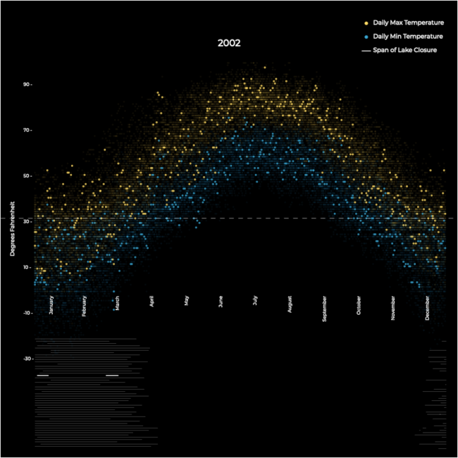
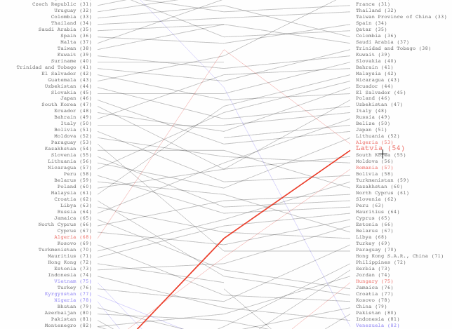
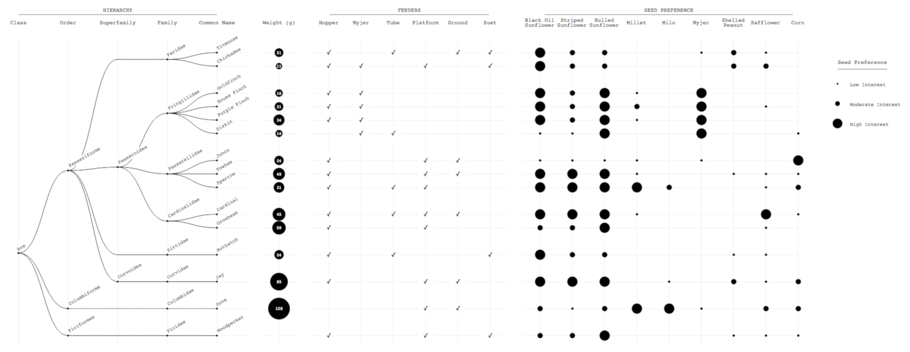

# data_viz
a collection of small data vizualizations, largely made with D3 and python

##### Lake Mendota Freeze/Thaw Cycles ([temperature data](http://www.aos.wisc.edu/~sco/clim-history/7cities/madison.html), [ice extent data](http://www.aos.wisc.edu/~sco/lakes/Mendota-ice.html))

##### World Happiness Slope Chart ([world happiness report](https://www.kaggle.com/unsdsn/world-happiness))

World happiness rankings from 2015-2017. Countries with a ranking change of 20+ spots either year over year, or across the span of the data, are highlighted respective to the direction of the change.

##### Bird Feeding Habits ([feeding data](https://i.imgur.com/RicYHQ3.jpg), [phylogenetic tree and weight data](https://holdenarb.org/))

The feeding behaviors of various birds in an Ohio nature sanctuary.